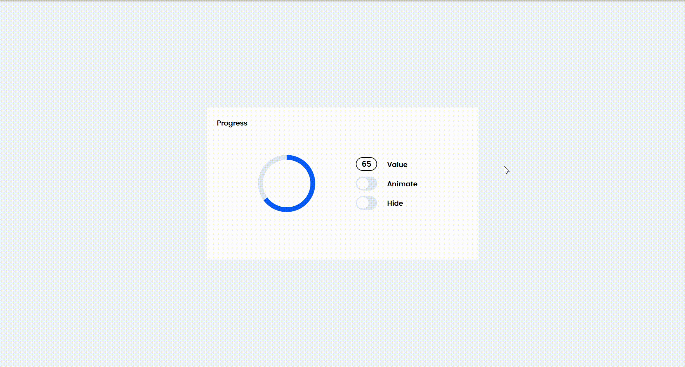

# Приложение для демонстрации работы блока Progress 
Стек: HTML, CSS, TS, Vite

## Превью


## Структура приложения
Для демонстрации работы реализован компонент `ProgressWidget`. Виджет состоит из самого блока `Progress` и настроек для управления состоянием блока: заполненности, анимации и прозрачности.


## Управление состоянием Progress
### Механиз состояния и отрисовки
В компоненте `Progress` реализован MVP-паттер:
- `EventEmitter` - базовый компонент, позволяет перехватывать события изменения модели данных лоадера.
- `Model` хранит состояние лоадера и оповещает подписчиков о изменениях своего состояния.
- `ProgressView` - представление лоадера, содержит методы влияющие на его отображение, такие как процент заполненности, анимация и прозачность.
- `Presenter` - компонент объединяющий представление лоадера с его моделью, слушает события, вызывает необходимые изменения в отображении.

Устройство перерисовки блока:
```ts
class Presenter {
  constructor(private view: View, private model: Model, private events: IEvents) {
    //При первой отрисовки инициализирует состояние
    this.view.initialize(model.value, model.animate, model.hide); 

    //Отслеживает изменения в модели и производит необходимую отрисовку
    this.events.on('value:changed', () => {
      this.view.changeProgress(this.model.value);
    });

    this.events.on('animate:changed', () => {
      this.view.toggleAnimate(this.model.animate);
    });

    this.events.on('hide:changed', () => {
      this.view.toggleHide(this.model.hide);
    });
  }
}
```

### Механизм внешнего управления
Для независимого использования блока необходимо:
```ts
//Импортировать блок Progres
import { Progress } from "../Progress";
import { EventEmitter } from "../Progress/base/EventEmitter";
import Presenter from "./MVP/Presenter";
import { View } from "./MVP/View";
import style from "./ProgressWidget.css?inline";
import { CheckboxUI } from "./ui/checkbox";
import { InputUI } from "./ui/input";


export class ProgressWidget extends HTMLElement {
  constructor() {
    super();

    //Добавить блок в разметку
    //Задать ему id
    this.innerHTML = `
      <style>${style}</style>
      <div id="progress-widget" class="progress-widget">
        <h4 class="title">Progress</h4>
        <my-progress 
          id="widget-loader"
          class="widget-loader"
        ></my-progress>
        <form id="settings" class="settings">
          <my-inputui 
            title="Value" 
          ></my-inputui>
          <my-checkboxui 
            title="Animate"
          ></my-checkboxui>
          <my-checkboxui 
            title="Hide"
          ></my-checkboxui>
        </form>
      </div>
    `;

    const events = new EventEmitter();
    const settingsContainer = this.querySelector<HTMLFormElement>('#settings');
    if (settingsContainer) {
      //Найти блок по id, задав Progress типом для поиска, а id - селектором
      const progress = this.querySelector<Progress>('#widget-loader');
      if (progress) {
        const settings = new View(settingsContainer, events);
        //Изменять модель
        new Presenter(settings, progress.model, events)
      }
    }
  }
}
```

Варианты изменения модели:
```ts
progress.model.value = 50; //Контролирует заполненость элемента
progress.model.animate = true; //Контролирует анимацию элемента
progress.model.hide = true; //Контролирует прозрачность элемента
```

## Ссылка на деплой
https://lyrelka.github.io/Progress-test/